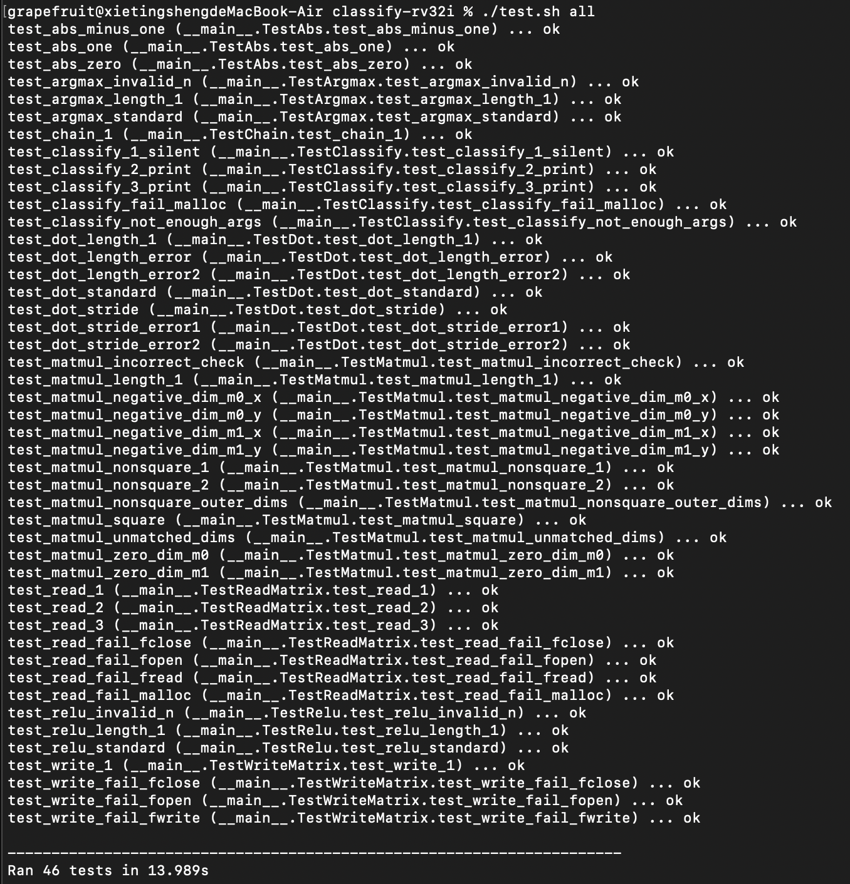

# Assignment 2: Classify

TODO: Add your own descriptions here.

During this assignment, I made several careless mistakes. For example, when writing simple programs like argmax.s, I mistakenly applied high-level language logic to RISC-V. One such error was setting the return value to the designated register but forgetting to include jr ra, instead using ret as the final instruction. This issue only surfaced while testing classify.s, as the tests focused solely on verifying the target register's contents. Additionally, I overlooked certain edge cases, such as multiplication by zero and handling negative numbers during multiplication.

I also optimized my implementation of multiplication (mul), though it turns out the original method was not actually problematic. Initially, my approach involved using a loop to decrement the multiplier while repeatedly adding the multiplicand, and I selected the smaller absolute value between the two numbers as the multiplier to reduce the number of iterations. Later, I switched to a method that detects the least significant bit (LSB) and accumulates powers of two of the multiplicand, ensuring the loop completes within 32 iterations.

Through this project, I gained a deeper understanding of how theoretical concepts are applied in practice. For instance, I learned more about how the stack is used to store arguments and return addresses, and I became more mindful of register management to avoid overwriting data needed in subsequent instructions. Since I come from a non-CS background, this was also my first time using GitHub for actions like pushing code, which was a valuable experience.

Overall, this assignment (project) provided me with significant insights and learning opportunities!

